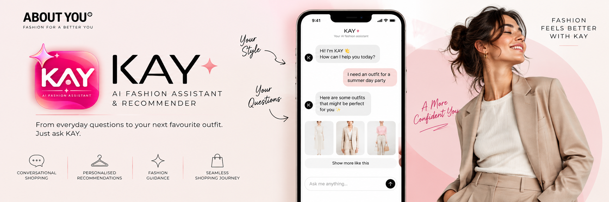
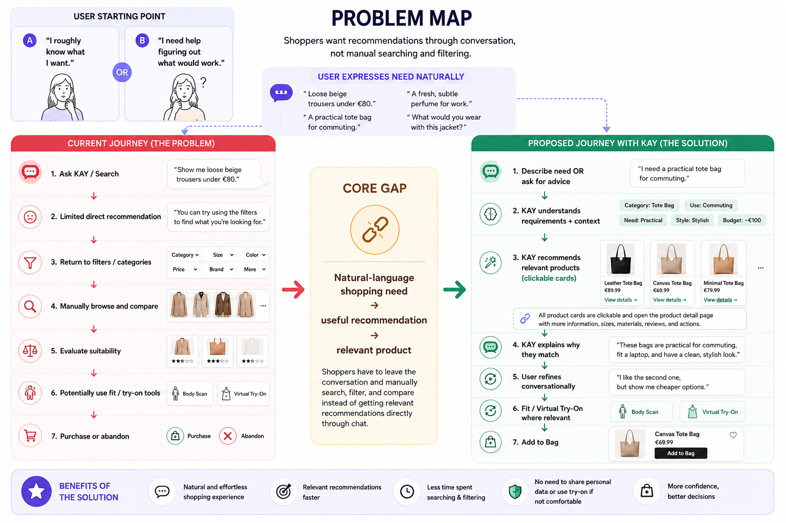
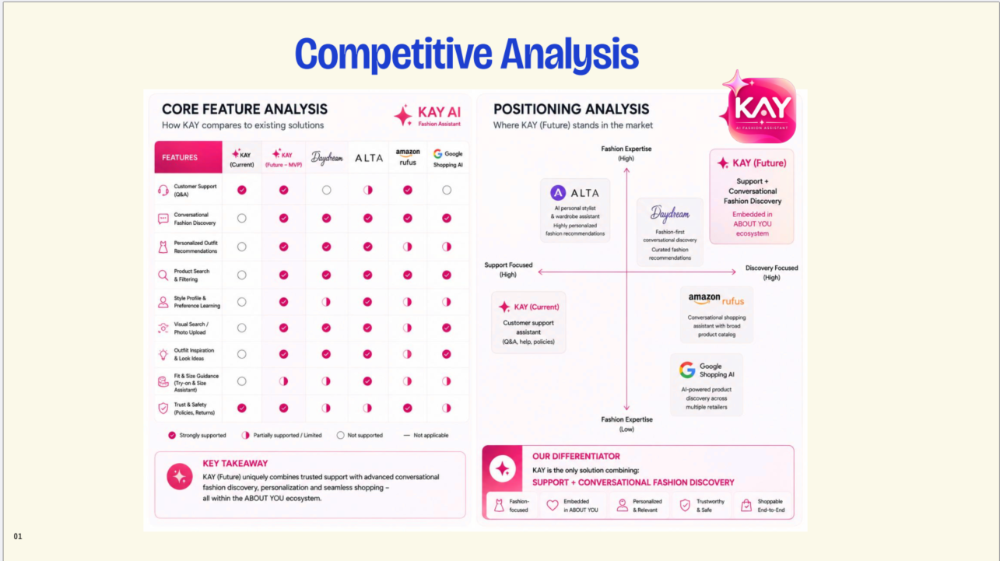
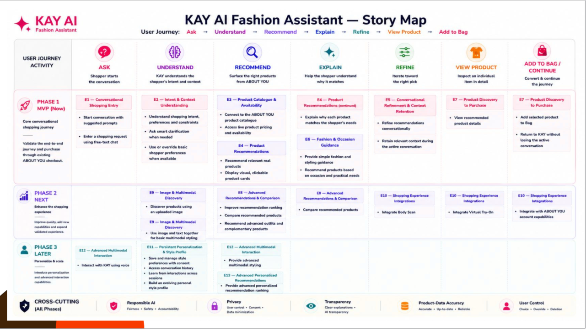
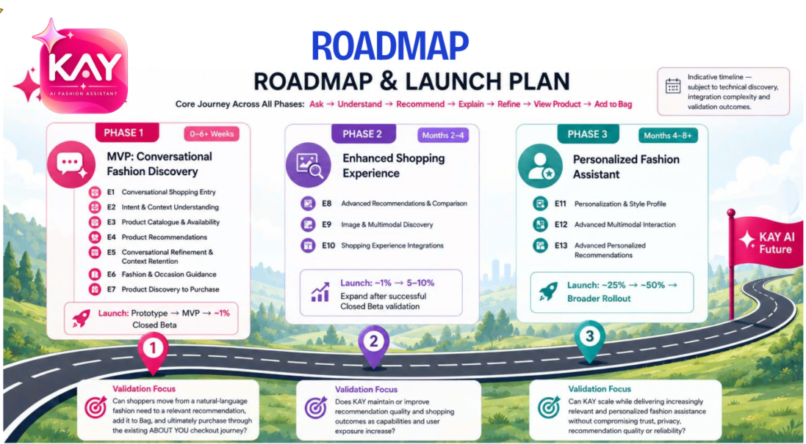
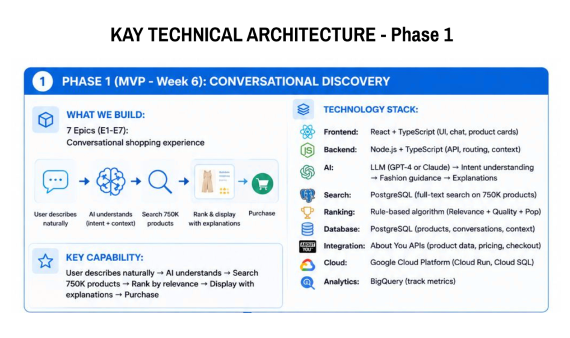
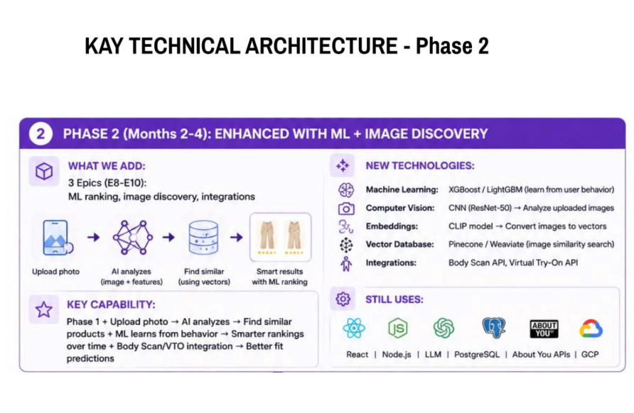
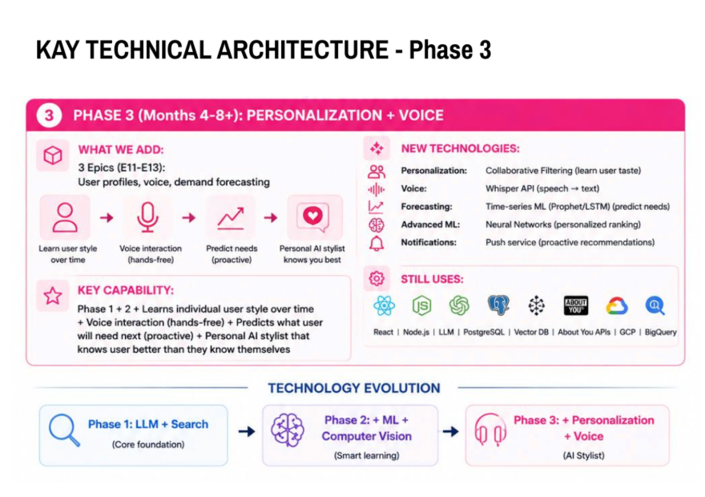

# 👗 KAY — AI Conversational Fashion Assistant & Recommender

### Product Management Case Study | ABOUT YOU

An AI Product Management case study exploring how ABOUT YOU's existing KAY customer-support assistant could be extended into a **conversational fashion discovery and product recommendation experience**, helping shoppers move from a natural shopping need to relevant, explainable and shoppable recommendations with less effort.

Created as part of the **Ironhack AI Product Management Bootcamp**

[](https://preview--kay-style-guide.lovable.app/)
[](docs/KAY-Product-Requirements-Document.pdf)
[](docs/KAY-Discovery-Report.pdf)
[](docs/KAY-Technical-Architecture.pdf)
[](docs/KAY-Case-Study-Presentation.pdf)

---

# 📖 Overview

Fashion shoppers do not always begin with an exact product in mind. Sometimes they roughly know what they want — such as **"beige trousers for a summer day party"** — while at other times they need more guidance, such as **"help me find an outfit for a date night."**

In this case study, I explored how ABOUT YOU's existing KAY customer-support experience could be extended into an **AI-powered conversational fashion assistant and product recommender**.

KAY allows shoppers to express their needs naturally, receive relevant product recommendations, understand **why** those products match, refine their options conversationally, and continue toward purchase within the existing ABOUT YOU shopping journey.

> **Ask → Understand → Recommend → Explain → Refine → View Product → Add to Bag**

---

# 🚀 Project at a Glance

| | |
|---|---|
| 👗 **Product** | KAY — AI Fashion Assistant & Recommender |
| 🏢 **Company Context** | ABOUT YOU |
| 🎯 **Objective** | Reduce friction between a shopper's natural fashion need and relevant product discovery |
| 👤 **Primary Persona** | Lea — 27-year-old young professional and frequent mobile fashion shopper |
| 📱 **Platform** | Mobile App |
| 🏷️ **Industry** | Fashion E-commerce |
| 🤖 **Product Type** | Conversational AI Fashion Assistant & Product Recommender |
| 📦 **MVP** | Conversational Discovery · Intent Understanding · Product Recommendations · Explainability · Refinement · Fashion Guidance · Add to Bag |
| 🛠️ **My Role** | Product Discovery · Competitive Analysis · Product Strategy · PRD · MVP Scoping · Story Mapping · Roadmap · AI Architecture · Prototype |
| 🧪 **Prototype** | Lovable |
| 🚀 **Future Vision** | Image Discovery · Advanced Recommendations · Persistent Style Profile · Multimodal Interaction · Personalization |

---

# 💡 Product Opportunity

KAY already supports customer-service needs within the ABOUT YOU experience.

The opportunity explored in this case study is to **extend KAY's role** beyond support into conversational fashion discovery — while retaining its existing support capabilities.

Instead of replacing traditional search and filters, KAY complements them by providing another way to shop when users want to express their needs naturally or need guidance deciding what to buy.

### Positioning

> **KAY brings conversational fashion guidance directly into the ABOUT YOU shopping journey, helping shoppers move from "what do I need?" to relevant, explainable and shoppable recommendations with less effort.**

---

# 1. Product Overview

### Product

**KAY — AI Fashion Assistant & Recommender**

### Platform

**ABOUT YOU Mobile App**

### Product Type

**AI-powered conversational fashion assistant and product recommender**

### MVP Prototype

Built using **Lovable**.

### Product Vision

KAY extends its existing customer-support role into a conversational shopping assistant that helps users discover and choose fashion products through natural language.

Shoppers can either:

- Describe what they roughly want
- Ask for guidance when they are unsure what would work

KAY interprets the shopper's intent, preferences and context, recommends relevant products, explains why they match, and allows recommendations to be refined conversationally.

### Core MVP Experience

> **Ask → Understand → Recommend → Explain → Refine → View Product → Add to Bag**

The subsequent checkout and purchase journey continues through ABOUT YOU's existing commerce experience.

---

# 2. The Problem

Fashion shoppers may know what they want in natural, contextual terms without knowing the exact search terms, categories or filters required to find it.

Sometimes the shopper roughly knows what they want:

> **"Suggest beige trousers for a summer day party."**

Other times, they need guidance:

> **"Help me find an outfit for a date night."**

In both situations, shoppers may still need to translate their needs into search terms, filters and manual browsing before finding relevant products.

### Core Problem

> **ABOUT YOU shoppers who want to discover products or receive fashion guidance conversationally may still need to translate their needs into search terms, filters and manual browsing, creating friction between how a shopping need is naturally expressed and how relevant products are discovered.**

### How Might We?

> **How might we enable ABOUT YOU shoppers to discover products, receive relevant recommendations, and refine their options through natural conversation without requiring them to manually translate their needs into multiple search filters?**

### Problem Map



---

# 3. Who Is KAY For?

## Primary Persona — Lea

**Age:** 27  
**Profile:** Young professional and frequent mobile fashion shopper

Lea often begins shopping with a general need, occasion or idea rather than an exact product specification.

Sometimes she roughly knows what she wants, such as beige trousers for a summer party.

At other times, she knows the situation but needs guidance, such as finding an outfit for a date night.

### Goal

> **Find products that match her needs, style and situation quickly, with enough guidance to feel confident about her choice.**

### Pain Points

- Translating an idea into categories and multiple filters takes effort
- Browsing and comparing many products can be time-consuming
- She does not always know exactly what product or style to search for
- Occasion-based shopping may require additional guidance

### Jobs To Be Done

> **When I know roughly what I need or the situation I'm shopping for, I want to describe it naturally and receive relevant recommendations, so that I can find suitable products without spending time manually searching, filtering and comparing many options.**

> **Note:** Lea is a working MVP persona based on the problem and target-user hypothesis. Her needs should be validated through real user research rather than treated as established ABOUT YOU customer evidence.

---

# 4. Discovery

Discovery explored how conversational AI could support fashion-product discovery within the existing ABOUT YOU shopping experience.

## Discovery Focus

The research explored:

- How shoppers express fashion and shopping needs
- Where search, filtering and browsing may create friction
- When shoppers know what they want versus when they need guidance
- Which information matters for relevant recommendations
- Expectations around size, budget, style and preferences
- The role of recommendation explanations and user trust
- Opportunities for personalization and image-based discovery

## Discovery Approach

The current discovery combines:

- Review of the existing KAY and ABOUT YOU shopping experience
- Competitor and market exploration
- Product hypothesis development
- AI-simulated exploratory interviews for hypothesis generation

### Research Limitation

The simulated interviews are **AI-generated exploratory scenarios**.

They do not represent actual ABOUT YOU customers or validated customer research.

Their purpose is to generate hypotheses that should later be tested through real interviews and prototype usability testing.

---

# 5. Key Discovery Insights & Hypotheses

## 1. Shopping Needs Can Be Naturally Conversational

Shoppers may think about what they need in terms of:

- Occasion
- Style
- Budget
- Colour
- Practical need
- Desired outcome

rather than exact product attributes.

Examples:

> "I need a practical tote bag for commuting."

> "Help me find something for a summer party."

**Hypothesis:** Natural-language product discovery could reduce the effort required to translate a shopping need into filters.

---

## 2. Shoppers Have Different Levels of Certainty

Two important shopping moments emerged:

### "I know roughly what I want"

The shopper has some requirements and wants relevant products quickly.

### "I need guidance"

The shopper knows the situation or desired outcome but wants help deciding what could work.

**Hypothesis:** Conversational discovery may provide the most value when users have partial intent or need guidance.

---

## 3. Clarification Should Help Without Adding Friction

Relevant information may include:

**Size · Colour · Style · Budget · Occasion · Practical constraints**

However, asking too many questions could simply replace filter friction with conversational friction.

**Hypothesis:** KAY should ask only clarification questions that materially improve recommendation relevance.

---

## 4. Recommendations Need to Be Actionable

A useful assistant should not stop at text-based advice.

Recommendations should connect directly to visual, clickable and shoppable products.

**Hypothesis:** Connecting conversation directly to product actions is necessary for KAY to create value beyond a general-purpose AI chatbot.

---

## 5. Explainability May Increase Confidence

KAY can explain why a product matches the shopper's request.

Example:

> **Why this matches:** Available in your size, within your budget and suitable for the occasion.

**Hypothesis:** Simple explanations may improve recommendation confidence and trust.

---

## 6. Personalization Requires User Control

Remembering preferences such as size, colours, style and budget may reduce repeated input.

However, shopping context changes.

Users should therefore be able to:

- Use saved preferences
- Change preferences
- Override them for an individual shopping journey

Persistent learning and an evolving style profile belong to later product phases.

---

## 7. Image Discovery Is a Future Opportunity

Some shoppers may find it easier to show what they want rather than describe it.

A future interaction could be:

> **Upload inspiration image → Tell KAY what to find → Receive similar products**

Image discovery is treated as a Phase 2 opportunity rather than a requirement for validating the core conversational MVP.

---

## 8. Body Scan & Virtual Try-On Can Remain Optional

KAY should provide useful conversational recommendations without requiring users to share image or body-related data.

Body Scan and Virtual Try-On can enhance the journey when relevant but should remain optional.

---

# 6. What We Would Validate With Real Users

Future discovery research should validate:

- Whether users experience meaningful friction translating shopping needs into search and filters
- Which shopping situations create the strongest need for conversational assistance
- Whether the two identified shopping moments reflect real behaviour
- Which clarification questions users consider useful
- Whether size and availability should be established before recommendations
- Whether "Why this matches" improves confidence
- Whether users value saved preferences
- Whether preference overrides are clear
- Whether image-based discovery is genuinely desirable
- What makes users trust or distrust AI fashion recommendations

The research process should separate:

> **Discovery interviews → validate the problem and user needs**

from:

> **Prototype usability testing → validate the proposed solution**

---

# 7. Competitive Landscape

Three primary competitors were selected because they represent different approaches to AI-assisted product discovery, conversational commerce and fashion recommendation.

## Daydream

Represents the **fashion-specialist conversational discovery** model.

**Strength:** Fashion-focused natural-language discovery allows shoppers to express requirements such as style, occasion, colour and budget naturally.

**Opportunity for KAY:** Bring conversational fashion discovery directly into the existing ABOUT YOU shopping experience and connect recommendations to product details and commerce actions.

---

## Amazon Rufus

Represents the **embedded conversational commerce assistant** model.

**Strength:** Demonstrates how conversational AI can support product discovery, questions, comparisons and recommendations within a large ecommerce environment.

**Opportunity for KAY:** Specialize more deeply in fashion context such as occasion, style, aesthetic, fit and complementary products.

---

## Google Shopping AI

Represents the **AI-powered cross-retailer shopping discovery** model.

**Strength:** Combines natural-language product discovery with a large shopping ecosystem.

**Opportunity for KAY:** Provide a contained fashion journey where:

> **Conversation → Recommendation → Refinement → Product Detail → Add to Bag**

remains within the ABOUT YOU ecosystem.

---

## Competitive Takeaway

The competitive landscape suggests four important patterns:

- Conversational discovery is emerging
- Recommendations need to connect to real products
- Fashion context creates an opportunity for specialization
- Integration into an existing commerce journey matters

### KAY Opportunity

> **KAY's opportunity is not simply to add another AI chatbot, but to combine conversational fashion guidance with ABOUT YOU's existing product and shopping ecosystem.**

### Positioning Statement

> **KAY brings conversational fashion guidance directly into the ABOUT YOU shopping journey, helping shoppers move from "what do I need?" to relevant, explainable and shoppable recommendations with less effort.**



---

# 8. Product Solution

KAY extends the existing customer-support experience into conversational fashion discovery.

### Example — Product Discovery

**Shopper**

> "Suggest beige trousers for a summer day party."

KAY interprets:

- Product category
- Colour
- Occasion
- Seasonal context
- Relevant preferences

and recommends suitable products.

### Example — Fashion Guidance

**Shopper**

> "Help me find an outfit for a date night."

KAY can ask a useful clarification question, understand the context and recommend relevant products.

Recommendations appear as **visual, clickable product cards** containing:

- Product image
- Brand
- Product name
- Price
- Relevant availability information
- Short recommendation explanation
- View Product action

The shopper can then refine naturally:

> "Show me similar options under €80."

> "I like the second one, but show me something more casual."

KAY retains relevant context instead of requiring the shopper to restart the search.

---

# 9. Core User Journey

The core conversational-shopping journey is:

> **Ask → Understand → Recommend → Explain → Refine → View Product → Add to Bag**

The existing ABOUT YOU checkout flow then completes the purchase journey.

---

# 10. MVP Scope

The MVP tests whether shoppers can use natural conversation to move from a shopping need or fashion question to **relevant, explainable and shoppable product recommendations**.

KAY retains its existing customer-support capabilities while the MVP extends the experience into conversational fashion discovery.

## Phase 1 — MVP / Build Now

### E1 — Conversational Shopping Entry

- Start conversation with suggested prompts
- Enter a shopping request using free-text chat

### E2 — Intent & Context Understanding

- Understand shopping intent, preferences and constraints
- Ask smart clarification when needed
- Use or override basic shopper preferences when available

### E3 — Product Catalogue & Availability

- Connect to the ABOUT YOU product catalogue
- Access live product pricing and availability

### E4 — Product Recommendations

- Recommend relevant real products
- Display visual, clickable product cards
- Explain why each product matches the shopper's needs

### E5 — Conversational Refinement & Context Retention

- Refine recommendations conversationally
- Retain relevant context during the active conversation

### E6 — Fashion & Occasion Guidance

- Provide simple fashion and styling guidance
- Recommend products based on occasion and practical needs

### E7 — Product Discovery to Purchase

- View recommended product details
- Add selected product to Bag
- Return to KAY without losing the active conversation

---

# 11. Next & Later

## Phase 2 — Next

### E8 — Advanced Recommendations & Comparison

- Improve recommendation ranking
- Compare recommended products
- Recommend advanced outfits and complementary products

### E9 — Image & Multimodal Discovery

- Discover products using an uploaded image
- Use image and text together for basic multimodal styling

### E10 — Shopping Experience Integrations

- Integrate Body Scan
- Integrate Virtual Try-On
- Integrate with ABOUT YOU account capabilities

---

## Phase 3 — Later

### E11 — Persistent Personalization & Style Profile

- Save and manage style preferences with consent
- Access conversation history
- Learn from interactions across sessions
- Build an evolving personal style profile

### E12 — Advanced Multimodal Interaction

- Provide advanced multimodal styling
- Interact with KAY using voice

### E13 — Advanced Personalized Recommendations

- Provide advanced personalized recommendation ranking

---

# 12. Explicitly Out of Scope for the MVP

The MVP does not include:

- Building or replacing checkout and payment functionality
- Building new Body Scan technology
- Building new Virtual Try-On technology
- Production recommendation infrastructure
- Rebuilding KAY's existing customer-support functionality

The MVP instead integrates with or conceptually hands off to existing ABOUT YOU commerce capabilities.

---

# 13. User Story Map

The story map organizes E1–E13 against the end-to-end user journey:

> **Ask → Understand → Recommend → Explain → Refine → View Product → Add to Bag**

It separates functionality into:

- **Phase 1 — MVP**
- **Phase 2 — Next**
- **Phase 3 — Later**
- **Cross-cutting Responsible AI and privacy considerations**



---

# 14. Product Roadmap

KAY develops from a core conversational-shopping MVP into an increasingly capable and personalized fashion assistant.

## Phase 1 — MVP: Conversational Fashion Discovery

**Timeline:** 0–6+ weeks  
**Build:** E1–E7

### Goal

Validate whether conversational fashion discovery helps shoppers find, refine and purchase relevant ABOUT YOU products.

### Launch

> **Prototype → MVP → ~1% Closed Beta**

---

## Phase 2 — Enhanced Shopping Experience

**Timeline:** Months 2–4  
**Build:** E8–E10

### Goal

Improve recommendation quality, expand KAY's shopping capabilities and progressively scale the validated experience.

### Launch

> **~1% → 5–10% → ~25%**

---

## Phase 3 — Personalized Fashion Assistant

**Timeline:** Months 4–8+  
**Build:** E11–E13

### Goal

Scale the validated KAY experience while introducing consent-based personalization and advanced interaction capabilities.

### Launch

> **~25% → ~50% → Broader Rollout**

---

## Launch Progression

> **Prototype → Internal Validation → Functional MVP → ~1% Closed Beta → 5–10% → ~25% → ~50% → Broader Rollout**

Progression to the next stage depends on validation of:

**User Value · Recommendation Quality · Product/Data Accuracy · Technical Reliability · Responsible AI · Privacy & Security**



---

# 15. Success Metrics

## Primary Metric — AI Recommendation Purchase Rate

### What We Measure

The percentage of users who purchase at least one product recommended by KAY.

### Formula

> **Users who purchase ≥1 KAY-recommended product ÷ Users who receive KAY recommendations × 100**

### MVP Target

> **≥20%**

### Why It Matters

This measures whether KAY helps shoppers discover products they actually want to purchase rather than simply generating conversational engagement.

---

## Secondary Metric — Recommendation CSAT

After recommendations, shoppers can answer:

> **"Was this recommendation helpful?" 👍 / 👎**

### Formula

> **👍 responses ÷ (👍 + 👎 responses) × 100**

### MVP Target

> **≥70% Recommendation CSAT**

This captures perceived recommendation quality even when a recommendation does not ultimately result in a purchase.

---

# 16. Risks & Dependencies

## Recommendation Quality

**Risk:** Fashion preferences are subjective, so recommendations may match attributes while still feeling irrelevant.

**Mitigation:** Conversational refinement, recommendation feedback and continuous relevance monitoring.

---

## AI Reliability & Scalability

**Risk:** AI responses may be inaccurate, inconsistent or too slow.

**Mitigation:** Guardrails, error monitoring, performance monitoring and progressive rollout.

---

## Conversational Friction

**Risk:** Too many clarification questions or overly long responses could make conversation slower than traditional search.

**Mitigation:** Ask only questions that materially improve recommendations and keep responses concise.

---

## Product Data & Commerce Integration

KAY depends on:

- ABOUT YOU product catalogue / APIs
- Live pricing
- Size and stock availability
- Product Detail services
- Add-to-Bag integration
- Existing checkout infrastructure
- AI / LLM services

Accurate product data is essential so KAY does not recommend unavailable or incorrectly priced products.

---

# 17. Responsible AI

Responsible AI is treated as a cross-cutting requirement throughout the roadmap.

## AI Transparency

Users should understand that KAY is AI-powered and recommendations are AI-generated based on provided preferences and context.

## Explainable Recommendations

KAY should provide a short **"Why this matches"** explanation connected to the shopper's requirements.

## No Invented Product Information

KAY should not fabricate:

- Products
- Prices
- Availability
- Attributes
- Capabilities

## User Control

Recommendations remain suggestions.

Users can:

- Refine them
- Reject them
- Ignore them
- Change preferences
- Continue using traditional search

## Consent for Personal Images & Video

Image discovery, multimodal styling, Body Scan and Virtual Try-On require appropriate user consent before personal media is processed.

## Sensitive Information

KAY should not request unnecessary sensitive information to provide fashion recommendations.

---

# 18. Security & Privacy

KAY follows a **data-minimization approach**.

Key principles include:

- Collect only data necessary for the requested experience
- Apply appropriate retention and access controls to conversation data
- Require consent for processing personal images/video
- Keep image/body-based functionality optional
- Limit access to account and shopping data to what is necessary
- Apply authentication and access controls
- Conduct appropriate privacy and security review before broader rollout

---

# 19. AI Technical Architecture

The proposed technical architecture evolves alongside the product roadmap.

> **Important:** The exact technologies below are proposed/reference architecture options rather than claims about ABOUT YOU's current production infrastructure. Final implementation would need to align with ABOUT YOU's existing engineering standards, infrastructure, APIs and preferred technology stack.

## Architecture Overview



---

## Phase 1 — LLM + Search + Rules

**Scope:** E1–E7

### Proposed Technology

- **Frontend:** React + TypeScript
- **Backend:** Node.js + TypeScript
- **AI / LLM:** GPT-class or Claude-class LLM
- **Search:** PostgreSQL product/full-text search
- **Ranking:** Rule-based relevance ranking
- **Database:** PostgreSQL
- **Integration:** ABOUT YOU product and commerce APIs
- **Cloud:** Google Cloud Platform as an illustrative option
- **Analytics:** BigQuery as an illustrative option

### LLM Responsibilities

The LLM can support:

- Intent understanding
- Preference and constraint extraction
- Clarification questions
- Fashion guidance
- Recommendation explanations
- Active-session conversational context

### Core Flow

> **User describes need → KAY understands intent/context → Product search → Rule-based ranking → Recommendations → Explanation → View Product → Add to Bag → Existing checkout → Buy**

The MVP is intentionally based primarily on:

> **LLM + Search + Rules**

rather than a complex trained recommendation model.

---

## Phase 2 — ML + Computer Vision + Vector Search

**Scope:** E8–E10

Potential additions include:

- XGBoost / LightGBM recommendation ranking
- Computer-vision models for image analysis
- CLIP or equivalent multimodal embeddings
- Vector database / similarity search
- Image-based product discovery
- Body Scan integration
- Virtual Try-On integration
- Account integrations

### Technical Evolution

> **Phase 1 + Machine Learning + Computer Vision + Vector Search**

This phase moves recommendation ranking from primarily rules-based logic toward learned ranking using behaviour.

---

## Phase 3 — Personalization + Advanced Ranking + Voice

**Scope:** E11–E13

Potential additions include:

- Persistent style profile
- Collaborative filtering
- Cross-session personalization
- Advanced personalized ranking
- Voice / speech-to-text
- Multimodal interaction
- Predictive or proactive recommendations where justified
- Push-notification infrastructure

### Technical Evolution

> **Phase 1 + Phase 2 + Persistent Personalization + Advanced Ranking + Voice**

The main product shift becomes:

> **"What does this shopper want right now?"**

toward:

> **"What does this shopper usually prefer, and how should that context improve this shopping session?"**


---

## Technology Evolution


The overall technical progression is:

```text
Phase 1
LLM + Search + Rules
        ↓
Phase 2
+ Machine Learning
+ Computer Vision
+ Vector Search
        ↓
Phase 3
+ Persistent Personalization
+ Advanced Ranking
+ Voice / Multimodal Interaction
```

---

# 20. Interactive Prototype

A mobile-first interactive prototype was created in **Lovable** to demonstrate the KAY conversational-shopping concept.

The prototype explores interactions including:

- KAY entry from the ABOUT YOU experience
- Suggested conversation starters
- Free-text shopping requests
- Basic shopper preferences
- Clarification questions
- Visual recommendation cards
- "Why this matches" explanations
- Conversational refinement
- Product Detail
- Add to Bag
- Return to KAY with active conversation context
- Preference management
- Exploratory image-upload interaction

### 📱 Try the Prototype

👉 **[Open KAY Interactive Prototype](https://preview--kay-style-guide.lovable.app/)**

> The prototype demonstrates product behaviour and user experience. It does not represent a production implementation of the proposed AI, product catalogue, recommendation or infrastructure architecture.

---

# 21. Future Opportunities

Potential opportunities beyond the current roadmap include:

### Smart Wardrobe / Wardrobe-Aware Styling

Combine products the shopper already owns with recommended ABOUT YOU products.

### Wardrobe-Aware Outfit Bundling

Show multiple ways a new item could work with existing wardrobe pieces.

### Celebrity / Influencer Style Inspiration

Allow users to request products inspired by a particular fashion aesthetic.

### Social Sharing & Co-Shopping

Allow shoppers to share recommendations or outfits with friends and collect feedback.

These opportunities would be explored only after validation of the core roadmap.

---

# 22. Project Documentation

| Artifact | Description |
|---|---|
| 📘 [Discovery Report](docs/KAY-Discovery-Report.pdf) | Discovery approach, AI-simulated exploratory research, hypotheses, competitor analysis, opportunity prioritization, problem statement and product concept |
| 📋 [Product Requirements Document](docs/KAY-Product-Requirements-Document.pdf) | Product vision, persona, JTBD, MVP requirements, epics, roadmap, metrics, risks, Responsible AI and privacy |
| 🧠 [Technical Architecture](docs/KAY-Technical-Architecture.pdf) | Proposed technical evolution across conversational AI, ML/image discovery and personalization |
| 🎤 [Case Study Presentation](docs/KAY-Case-Study-Presentation.pdf) | Visual presentation of the problem, solution, research, roadmap, metrics, architecture and prototype |
| 📱 [Interactive Prototype](https://preview--kay-style-guide.lovable.app/) | Lovable mobile prototype of the KAY experience |

---

# 23. Product Management Process

This case study follows an iterative product-management approach:

> **Discover → Define → Prioritize → Scope → Prototype → Validate → Iterate → Scale**

Methods used include:

- Discovery Research
- AI-Simulated Exploratory Research
- Competitive Analysis
- Problem Mapping
- Persona Development
- Jobs To Be Done
- How Might We
- Opportunity Prioritization
- MVP Scoping
- Epics & User Stories
- User Story Mapping
- Product Roadmapping
- Success Metrics
- Risk & Dependency Analysis
- Responsible AI
- Privacy & Security
- Technical Architecture
- Interactive Prototyping

---

# 24. Key Learnings

## Start With the Problem, Not the AI

AI is useful only when it meaningfully improves an existing user journey.

## Conversation Should Reduce Friction, Not Recreate It

If an AI assistant asks too many questions, it can become another form of filtering.

## Recommendations Need to Be Actionable

The value is not simply generating fashion advice but connecting guidance to relevant products and shopping actions.

## Explainability Matters

Showing **why** a recommendation matches can support transparency and confidence.

## User Control Is Essential for Personalization

Saved preferences and future personalization should be useful without preventing users from changing context.

## Technical Complexity Should Follow Validation

The architecture intentionally progresses from:

> **LLM + Search + Rules**

to:

> **ML + Computer Vision + Vector Search**

and later:

> **Persistent Personalization + Advanced Ranking + Voice**

rather than introducing complex infrastructure before proving the core product value.

---

# 25. Next Steps

The next steps for KAY would be:

1. Conduct real discovery interviews with target fashion shoppers
2. Validate whether the identified problems and shopping moments occur in practice
3. Run moderated usability testing with the current prototype
4. Test recommendation relevance and conversational refinement
5. Validate the usefulness of "Why this matches"
6. Improve preference management and conversation quality
7. Test whether users successfully progress toward Add to Bag and purchase
8. Validate technical integration assumptions with ABOUT YOU engineering
9. Define production data, privacy and Responsible AI requirements
10. Progressively test the experience through a small Closed Beta

---

# Disclaimer

> **This repository presents an independent educational Product Management case study. It is not an official ABOUT YOU product, roadmap or company initiative. Proposed functionality, technical architecture, metrics, research findings and future capabilities represent concept work unless explicitly identified as existing functionality. AI-simulated interviews are used for hypothesis generation only and do not represent real ABOUT YOU customer research. ABOUT YOU and related trademarks belong to their respective owners.**
